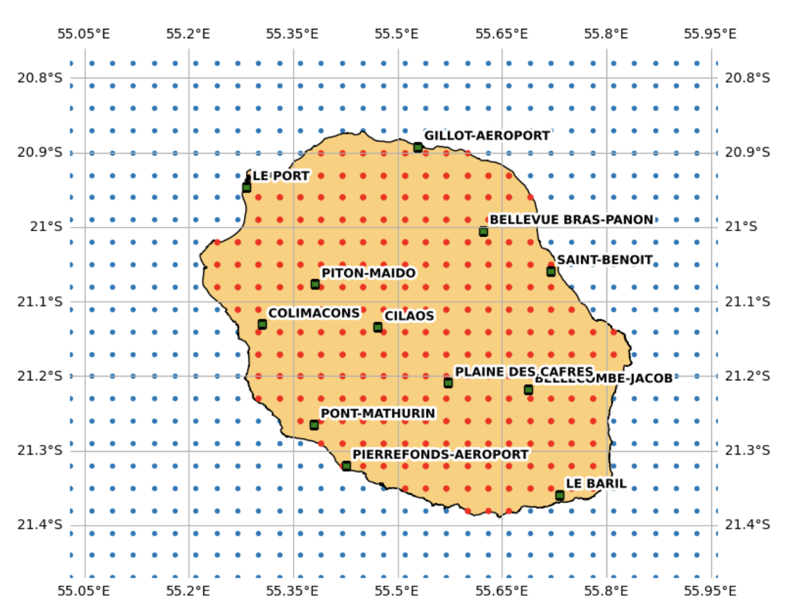

# TMY-RUN — Années Météorologiques Types pour le territoire de La Réunion

**Dernière mise à jour : 27 août 2026**

## Contexte

La Réunion présente une forte variabilité climatique à l’échelle du territoire, liée notamment à son relief marqué et aux interactions entre l’océan et la topographie. L’île compte ainsi de nombreux microclimats, avec des variations importantes de température, d’humidité, de vent et de rayonnement solaire selon les régions.

Dans ce contexte, l’utilisation de données météorologiques représentatives est essentielle pour les simulations énergétiques des bâtiments et l’évaluation de leurs performances. Le projet **TMY-RUN** vise à produire des Années Météorologiques Types (TMY) actualisées et adaptées aux conditions climatiques de La Réunion, avec une meilleure couverture spatiale et une prise en compte des données récentes.

Ce dépôt rassemble plusieurs jeux de TMY produits à partir de différentes sources météorologiques.

## Sources de données

### 1. TMYs issus des stations Météo-France

Ces TMYs sont construits à partir de données horaires mesurées par les stations météorologiques de **Météo-France Réunion**, disponibles sur la période **2010–2025**.

Les données ont fait l’objet d’un contrôle de qualité. Pour chaque station et chaque mois, seuls les mois présentant :

* un taux de complétude d’au moins **95 %** ;
* aucun trou de données supérieur à **4 heures consécutives** ;

ont été retenus pour la génération des TMYs.

La profondeur temporelle disponible varie ainsi selon les stations et les mois, en fonction de la disponibilité des données **(au moins 7 ans)**.

La génération des TMYs suit la méthodologie de la **norme ISO 15927-4**, basée notamment sur la comparaison statistique des mois candidats avec les conditions climatiques de long terme.

### Stations disponibles

Les TMYs issus des stations Météo-France actuellement disponibles dans le dépôt sont :

1. `BELLECOMBE-JACOB`
2. `BELLEVUE_BRAS-PANON`
3. `CILAOS`
4. `COLIMACONS`
5. `GILLOT-AEROPORT`
6. `LE_BARIL`
7. `LE_PORT`
8. `PIERREFONDS-AEROPORT`
9. `PITON-MAIDO`
10. `PLAINE_DES_CAFRES`
11. `PLAINE_DES_PALMISTES`
12. `PONT-MATHURIN`
13. `SAINT-BENOIT`

Les fichiers de stations sont disponibles principalement aux formats **EPW**, **TMY3** et **CSV**, selon les répertoires.

## 2. TMYs issus du projet BRIO

Le projet **BRIO (Building Resilience in the Indian Ocean)** fournit des simulations climatiques régionales couvrant notamment La Réunion. Les données sont issues du modèle régional **ALADIN-Climat**, initialement à une résolution de 12 km, puis régionalisées à une résolution de **3 km**.

Cette source permet d’obtenir une couverture spatiale continue sur l’ensemble du territoire, complémentaire aux données ponctuelles des stations météorologiques.

Les données BRIO étant disponibles à une résolution temporelle quotidienne, une **descente d’échelle temporelle du quotidien vers l’horaire** est appliquée afin de produire des séries météorologiques horaires adaptées à la génération de TMY.

Les TMYs BRIO sont désormais répartis selon les jeux de données et scénarios climatiques suivants :

* `TMY_BRIO_krigged` — TMYs BRIO spatialisés/krigés ;
* `TMY_BRIO_ssp126` — TMYs BRIO pour le scénario `ssp126` GES (Gaz à Effet de Serre) faibles (SSP1-2.6) ;
* `TMY_BRIO_ssp245` — TMYs BRIO pour le scénario `ssp245` GES intermédiaires (SSP2-4.5) ;
* `TMY_BRIO_ssp370` — TMYs BRIO pour le scénario `ssp370` GES élevées (SSP3-7.0) ;
* `TMY_BRIO_ssp585` — TMYs BRIO pour le scénario `ssp585` GES très élevées (SSP5-8.5).

La chaîne de traitement peut être résumée ainsi :

**BRIO quotidien → grille 3 km → descente d’échelle temporelle → données horaires → TMY**

Les fichiers sont identifiés par leur position sur la grille, le jeu de données ou scénario climatique, et leurs coordonnées géographiques. Par exemple :

`TMY_REU_i03_j18_ssp126_lat-21.380_lon55.570.csv`

Pour les fichiers krigés :

`TMY_REU_i03_j18_krigged_lat-21.380_lon55.570.csv`

ou, au format TMY3 :

`TMY_REU_i03_j18_krigged_lat-21.380_lon55.570_TMY3.csv`

<p align="center">
  
</p>

## 3. TMYs Meteonorm

Le dépôt contient également des **TMYs provenant de Meteonorm**, utilisés notamment comme source de comparaison et de référence dans l’évaluation des différents jeux de données météorologiques.

## Organisation du dépôt

```text
TMY-RUN/
│
├── TMY_BRIO_krigged/
│   ├── CSV_EPW/
│   ├── AUDIT-DDY-STAT/
│   ├── EPW/
│   └── TMY3/
│
├── TMY_BRIO_ssp126/
│   ├── CSV_EPW/
│   ├── AUDIT-DDY-STAT/
│   ├── EPW/
│   └── TMY3/
│
├── TMY_BRIO_ssp245/
│   ├── CSV_EPW/
│   ├── AUDIT-DDY-STAT/
│   ├── EPW/
│   └── TMY3/
│
├── TMY_BRIO_ssp370/
│   ├── CSV_EPW/
│   ├── AUDIT-DDY-STAT/
│   ├── EPW/
│   └── TMY3/
│
├── TMY_BRIO_ssp585/
│   ├── CSV_EPW/
│   ├── AUDIT-DDY-STAT/
│   ├── EPW/
│   └── TMY3/
│
├── tmy_meteonorm/
│
├── images/
│
└── TMY_Stations/
    ├── AUDIT-DDY-STAT/
    ├── CSV_EPW/
    ├── EPW/
    └── TMY3/
```

### TMY_BRIO_krigged

Contient les TMYs spatialisés/krigés issus des données BRIO à une résolution de **3 km**, après descente d’échelle temporelle vers une résolution horaire.

### TMY_BRIO_ssp126, TMY_BRIO_ssp245, TMY_BRIO_ssp370 et TMY_BRIO_ssp585

Contiennent les TMYs BRIO organisés par scénario climatique. Chaque répertoire suit la même structure :

* `CSV_EPW/` — fichiers CSV structurés pour la conversion ou l’usage proche du format EPW ;
* `AUDIT-DDY-STAT/` — fichiers `.audit`, `.ddy` et `.stat` associés ;
* `EPW/` — fichiers au format EPW lorsque disponibles ;
* `TMY3/` — fichiers au format TMY3.

### TMY_Stations

Contient les TMYs générés à partir des observations des stations météorologiques de Météo-France, ainsi que les différents formats et fichiers associés à leur production :

* `AUDIT-DDY-STAT/` — fichiers d’audit et de statistiques ;
* `CSV_EPW/` — fichiers CSV associés aux EPW ;
* `DEF/` — fichiers de définition ;
* `EPW/` — fichiers au format EPW ;
* `TMY3/` — fichiers au format TMY3.

### tmy_meteonorm

Contient les fichiers TMY issus de **Meteonorm**.

## Formats

Selon la source et le répertoire, les données peuvent être disponibles dans différents formats, notamment :

* **EPW** — format utilisé notamment pour les simulations énergétiques des bâtiments ;
* **TMY3** — format Typical Meteorological Year ;
* **CSV** — format tabulaire permettant une utilisation et un traitement simplifiés.

Le projet **TMY-RUN** est financé par l’**ADEME**.
